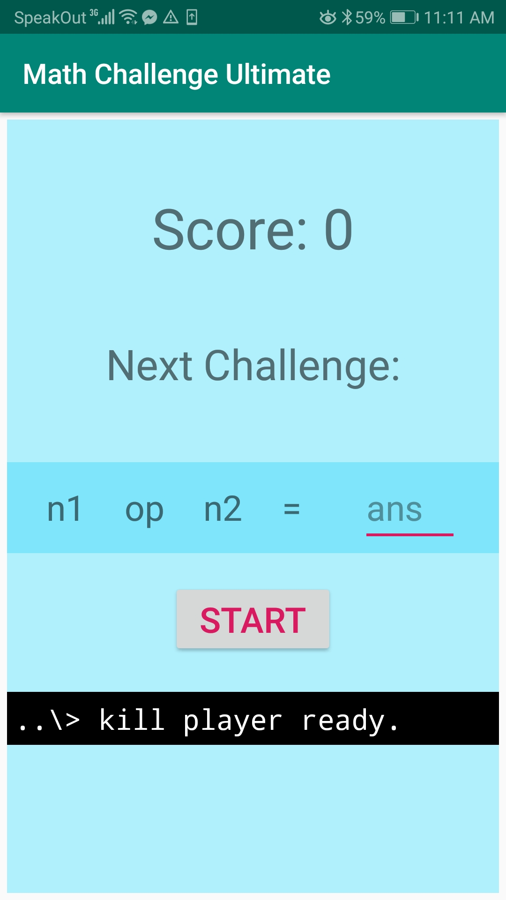
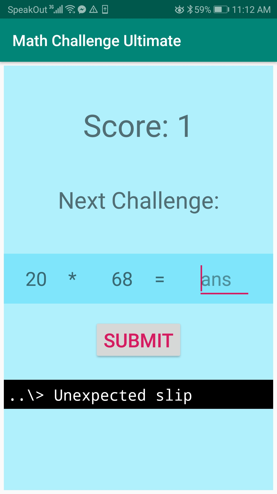

# MathChallenge
A simple math game created using Android Studio

# Screenshots
</img>
</img>

# How to Play

Click "Start" to begin game

Enter answer to arithmetic expression in the "ans" box

After each answer is submitted a message will be displayed depending on whether the answer is correct

The game ends after the player goes through either all of the messages for correct answers, or all of the messages for incorrect answers

